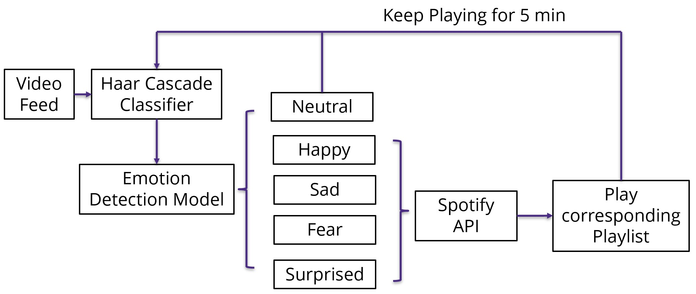
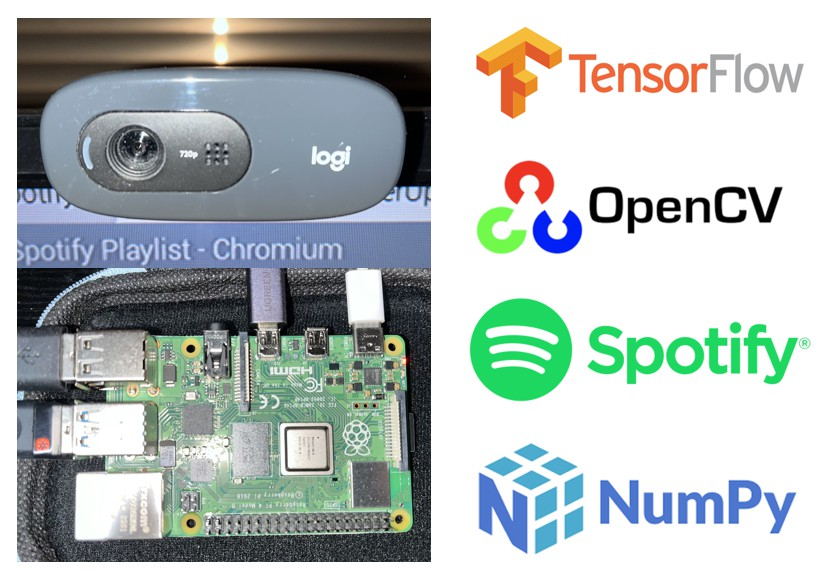

Key words: Raspberry Pi, Computer Vision, Emotion Recognition, Music Therapy, HCI.

This project, CheerUp, is a pioneering response to the largely untapped potential of using computing to offer emotional support and enhance mental well-being, situated at the fascinating intersection of technology and psychological health support. By harnessing the compact and versatile Raspberry Pi platform, it integrates emotional recognition with personalized music therapy. Utilizing facial expression analysis, the system detects the user's emotional state in real time and plays music from corresponding Spotify playlist specifically tailored to either enhance or complement the current emotion. Leveraging machine learning models, computer vision libraries, API integration, and real-time system monitoring, CheerUp aims to provide immediate emotional support, thus contributing significantly to the improvement of the user's mental well-being.

The architecture of this project commences with the acquisition of video data from a camera. This captured video is segmented into a series of frames, which are subsequently subjected to critical image processing tasks, including conversion to grayscale. This preparatory step is essential for facilitating the subsequent face detection process, utilizing the Haar Cascade classifier. Notably, this classifier demonstrates considerable proficiency in identifying faces within images, regardless of whether the subjects are human, animal, or absent altogether.

Initially, the project was configured to playback songs that were manually selected and stored within the project directory. This approach, however, was deemed excessively static and somewhat limiting. To enhance the system's flexibility and responsiveness to emotional cues, Spotify integration was introduced. This integration enables the system to dynamically select and play music playlists that correspond to the detected emotions of the user.

A key feature was made in how music playback is handled post-emotion detection. Now, once an emotion is identified and a corresponding playlist starts, the music continues for five minutes. This approach effectively avoids the instability of changing music with every emotional shift. Instead, it provides a stable and soothing auditory experience by maintaining a consistent playlist for a set duration.

Reference: 
[1] https://www.kaggle.com/datasets/msambare/fer2013
[2] https://circuitdigest.com/microcontroller-projects/raspberry-pi-based-emotion-recognition-using-opencv-tensorflow-and-keras
[3] https://spotipy.readthedocs.io/en/2.22.1/

