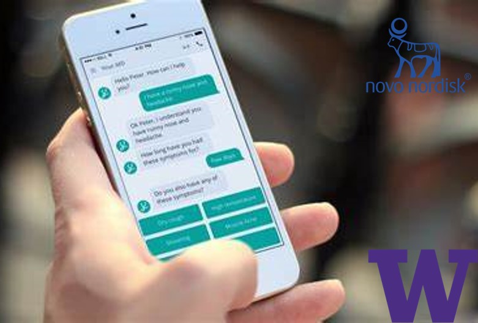
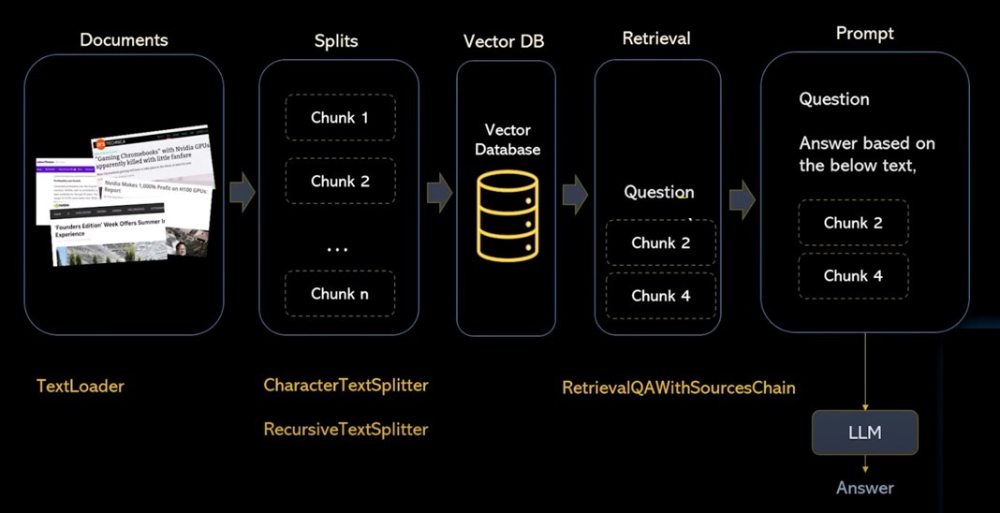
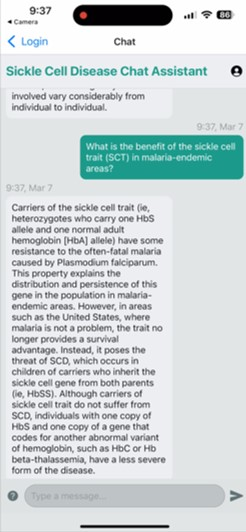

**Key words:** Mobile App, Chatbot, Sickle Cell Disease.

Sickle Cell Disease (SCD) is a rare, genetically inherited disease. Currently, there are about 100,000 SCD patients in the US. However, only a few emergency medicine doctors have received comprehensive training on how to treat them. We are designing a mobile chatbot app to assist doctors without prior knowledge of SCD in querying relevant information from official clinical practice guidelines published by the American Society of Hematology, enabling them to treat SCD patients promptly. To better understand the current challenges in this field, we have conducted **interviews** with several SCD physicians from three different states. We appreciate their voluntary assistance.

The system design of this chatbot application is outlined as follows: Initially, administrators upload verified official SCD guidelines and documents to an **AWS S3** bucket for cloud storage. Subsequently, the stored text data is processed by the **OpenAI API** to create text embeddings, which are then stored in a **Pinecone** vector database. When a physician enters prompts in the chat window, the app queries the vector database to search for similar embeddings. These similar embeddings are retrieved and decoded into text answers, providing doctors with immediate consultative support for patient treatment.

This graph shows how different files are parsed into pure text data and can be utilized by the chatbot.

We are currently working on the improvement of the chatbot UI and system integration.

**Caution:**  
This project is still in the initial stages of development and has not undergone any practical testing. It is <strong style="color: #9c0000;">NOT</strong> open-sourced or intended for clinical use at this time. If you have a relevant need, please consult a professionally licensed doctor in this field.

**Acknowledgement:**  
I am fortunate to collaborate with Shen, Tianli, Tejashree, Emily, Yong, and Aurelia on this project. We would like to express our gratitude for the generous support from Novo Nordisk Inc. and the University of Washington Department of Electrical and Computer Engineering.